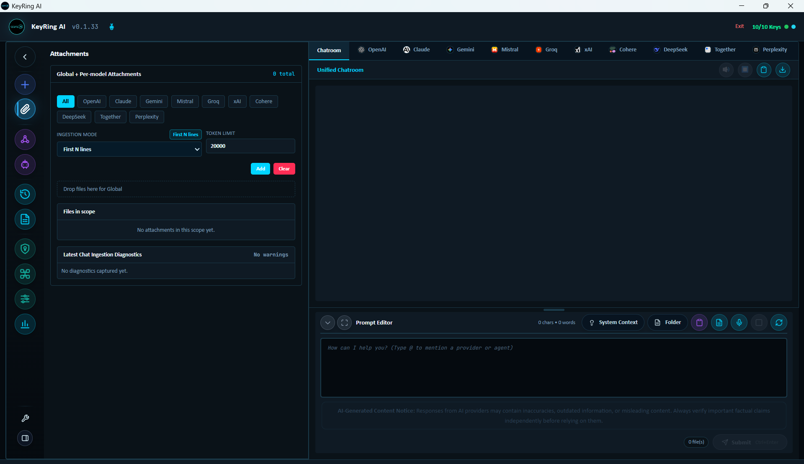

# Attachments

Attachments let users add local context to KeyRing AI workflows. They are useful for summarizing documents, comparing model handling of the same material, giving an agent a reference file, or running a Roundtable around a shared source.

_Public screenshot: Attachment Manager with global and provider-scoped attachment controls, ingestion mode, token limit, and diagnostics._

Attachments should be handled deliberately. If attachment content is included in a request to a provider, that provider receives the included content under the provider's terms.

## Attachment Scope

KeyRing AI supports attachment scoping so users can decide where a file applies. An attachment may be used globally in a workspace or scoped to a provider/model workflow. This helps prevent accidental over-sharing when one provider should see a file but another provider should not.

Before sending a prompt, review which attachments are active and where they are scoped. This is especially important in multi-provider workflows such as Chatroom and Roundtable.

## Ingestion Modes

Attachments can be included in different ways depending on the task.

Raw mode includes file content up to configured limits. Use it only when the model needs the file text.

First-lines mode includes only the beginning of a file. This is useful for quick inspection, log triage, schema detection, or preview-style analysis.

Metadata-only mode includes descriptive information without the full file contents. This is useful when the model only needs file names, sizes, or other high-level context.

Filename-only mode is the narrowest option. It is useful when the prompt references files by name but should not send content.

Choose the least amount of data that can complete the task.

## Upload And Review Workflow

Open Attachments and add the files needed for the task. Review the file list, scope, ingestion mode, character limits, and any diagnostics. If a file is rejected or trimmed, resolve that before sending a prompt that depends on it.

For multi-file work, add a short prompt that explains what each file represents and what the model should do with it. Models often perform better when attachment context is described rather than simply attached.

## Common Use Cases

Common workflows include summarizing a short document with one provider, asking multiple providers to compare the same public source material, attaching a schema excerpt for plain-language explanation, giving Roundtable participants the same reference document, or providing an agent with a limited set of files for a specific task.

## Data Handling Guidance

Do not attach provider API keys, passwords, private certificates, unreleased financial information, confidential customer data, regulated data, or private source code unless the selected provider and workflow have been explicitly approved.

Use metadata-only or filename-only modes when content is not required. Remove stale attachments after the task is complete. Review exports before sharing them because prompts and histories may reference attachments.

## Public Boundary

This document describes public attachment behavior. It does not include proprietary parsing implementation, internal file paths, private storage layout, source code, or customer data.
