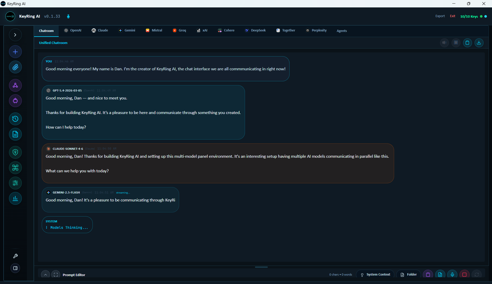

# Chatroom And Provider Tabs

KeyRing AI gives users two complementary ways to read model output: provider tabs and the unified Chatroom. Provider tabs are best for direct comparison and provider-specific troubleshooting. Chatroom is best for reviewing a multi-model conversation as a single transcript.

_Public screenshot: Chatroom collecting multiple provider responses into a unified transcript._

## Provider Tabs

Each provider tab represents output from one selected provider/model path. A tab can show readiness, streaming state, completion state, cancellation, retryable failure, configuration failure, token information, elapsed time, copy/export actions, and text-to-speech controls where available.

Provider tabs are useful when comparing model behavior side by side. They make it easy to see which provider answered first, which model returned an error, which response used more tokens, and which response should be copied or exported. Provider tabs can also show tool-call output blocks and media segments when the workflow includes tools or generated assets.

When a provider request fails, the tab should be treated as the first diagnostic surface. It often points the user toward the next correction: API Settings for missing or invalid keys, Provider Manager for model inventory or routing issues, Model Configuration for unsupported parameters, or the provider dashboard for quota, billing, and access issues.

## Chatroom

Chatroom collects replies into one readable conversation. It is useful when the user wants a transcript-style view of multiple models responding to the same prompt, participating in a Roundtable, or contributing to a shared workflow.

Chatroom mode can reduce the friction of comparing output because the user does not need to move between tabs to follow the discussion. It is especially helpful for Roundtable sessions, moderated workflows, and cases where provider identities should remain visible while the discussion reads as a single conversation.

Chatroom can also support text-to-speech playback with assigned voices when voice features are configured. This makes it easier to review multi-provider dialogue, especially in longer sessions.

## Consensus And Multi-Model Review

Some workflows produce a consensus-style view or synthesis. This should be treated as a review aid, not as a guarantee of correctness. Multiple models can agree and still be wrong. The value is in seeing convergence, divergence, uncertainty, and reasoning patterns across providers.

When using consensus output for important work, keep the original provider replies available. The detailed answers often contain caveats, assumptions, or useful disagreement that a summary may compress away.

## Choosing The Right View

Use provider tabs when you are testing setup, comparing latency, reviewing errors, inspecting token usage, or judging model-specific output.

Use Chatroom when you are following a multi-model conversation, running Roundtable, presenting a consolidated transcript, or using voice playback across multiple participants.

Use both when evaluating a provider change. Start with provider tabs to confirm readiness and error behavior, then use Chatroom to judge conversation quality.

## Export And Review

Provider output can be copied or exported from the workspace. Chatroom transcripts can also be exported for review. Before sharing any export, inspect it for prompts, attachments, customer material, internal names, credentials, or provider output that should not leave your organization.

## Public Boundary

This document describes user-visible workflow behavior. It does not include proprietary frontend implementation, internal state management, private source paths, or hidden provider-routing logic.
