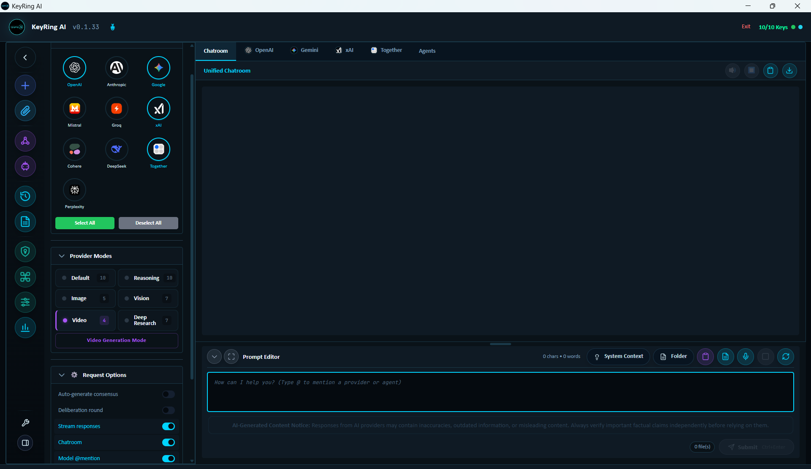
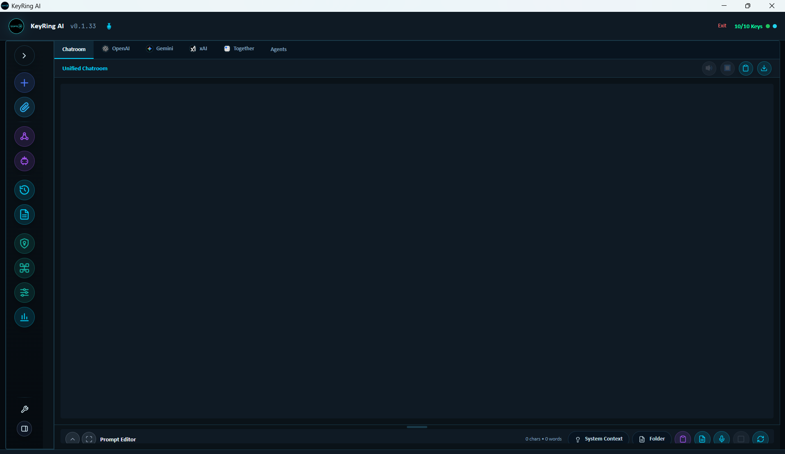
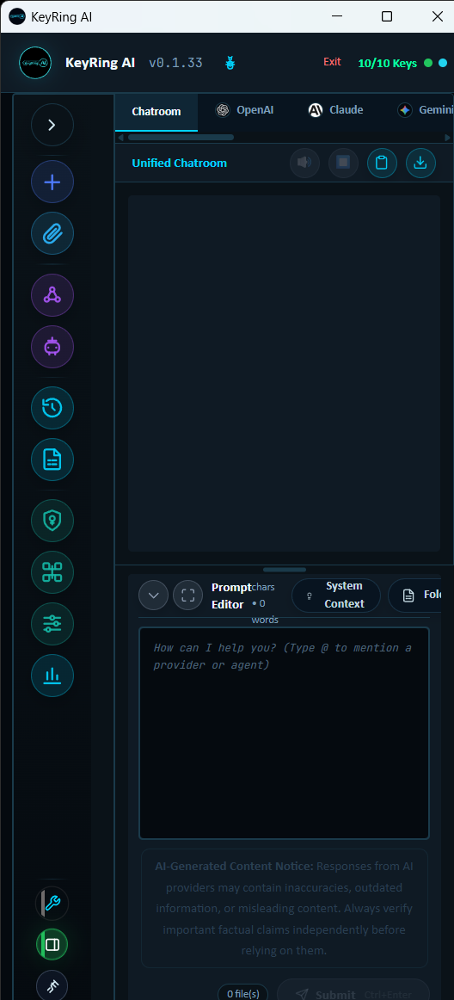

# Desktop Workspace

KeyRing AI is built around a desktop workspace, not a web chat page. The app gives one operator a local control plane for working with multiple AI providers, comparing model output, organizing reusable prompts, attaching context, tracking usage, and deciding when advanced tool access is appropriate.

## Screenshots

_Public screenshot: expanded side navigation with provider selection, modes, request options, Chatroom, and prompt editor._

_Public screenshot: collapsed navigation for a wider working canvas._

_Public screenshot: narrow dock mode for keeping KeyRing AI available beside other desktop work._

The workspace is intentionally local-first. During normal model use, KeyRing AI sends the prompt, selected attachments, and request options directly from the desktop app to the selected AI provider using the user's own provider API key. The KeyRing AI website is used for account, license, download, and update workflows. It is not a prompt relay.

## Main Regions

The header provides application-level status. It shows product version information, license and provider readiness, feedback and known-issue entry points, export access, update status, and exit controls.

The left navigation panel is the command center. It gives access to new chats, attachments, Roundtable, Agent Builder, conversation history, prompt presets, API key settings, provider management, model configuration, metrics, and general settings. It also includes workspace controls such as dock mode and pin-on-top behavior.

The responses area is where provider output is displayed. Depending on the workflow, it can show individual provider tabs, the unified Chatroom, a consensus view, agent execution output, or media job progress. Provider tabs expose status, tokens, elapsed time, retry paths, copy/export actions, and text-to-speech controls where available.

The prompt panel is where the user composes the next request. It supports a resizable editor, optional system context, request options, provider mode choices, and workflow toggles such as streaming, Chatroom routing, model mentions, tool calling, agents, and deliberation-style workflows when available.

## What The Workspace Is For

KeyRing AI is useful when a user wants to work across more than one model or provider without manually copying prompts between separate dashboards. Common workflows include comparing provider answers, keeping a local record of research sessions, collecting metrics about model usage, creating reusable prompt libraries, testing newly discovered models, running multi-model Roundtables, and building local agents that can use approved tools.

The workspace is also designed for controlled experimentation. A user can configure a provider, discover available models, map those models into modes such as chat, reasoning, vision, image, video, or research, and tune model settings without changing the provider account itself.

## Navigation Overview

New Chat starts a clean working session. Attachments opens the local attachment manager. Roundtable opens the multi-provider discussion workflow. Agent Builder opens the interface for creating and running local agents. History opens locally stored conversation history. Prompt Presets opens reusable prompt templates. API Keys opens provider credential and license management. Providers opens the provider registry and Model Discovery workflow. Model Config opens per-provider and per-model request shaping controls. Metrics opens local usage intelligence for requests, sessions, providers, models, latency, token counts, and estimated cost.

## Status And Feedback

KeyRing AI surfaces status close to the place where the user can act on it. Provider tabs show whether a model is ready, streaming, done, cancelled, or in error. The header shows whether provider keys are configured. Update checks and update progress are shown in the desktop app rather than hidden in a background process. Media jobs expose queue, running, completed, failed, and cancelled states.

When a provider request fails, KeyRing AI aims to classify the failure and point the user toward the relevant correction path. Some errors belong in API Settings, some belong in Provider Manager, some belong in Model Configuration, and some must be resolved in the provider's own dashboard because they are caused by quota, billing, access, or account-level restrictions.

## Local-First Boundary

Local-first does not mean no network activity. It means KeyRing AI does not operate as a prompt relay. When the user sends a request to a selected provider, that provider receives the prompt and any context the user chose to include. Provider accounts, terms, retention, billing, rate limits, and model access remain controlled by the provider.

KeyRing AI stores workspace data locally so the user can review, export, and delete it from the desktop app. The website layer handles commercial trust workflows such as account access, license validation, downloads, and updates.

## Public Boundary

This document describes public product behavior. It does not include proprietary source code, internal implementation details, private infrastructure, secrets, deployment configuration, customer data, or security bypass information.
