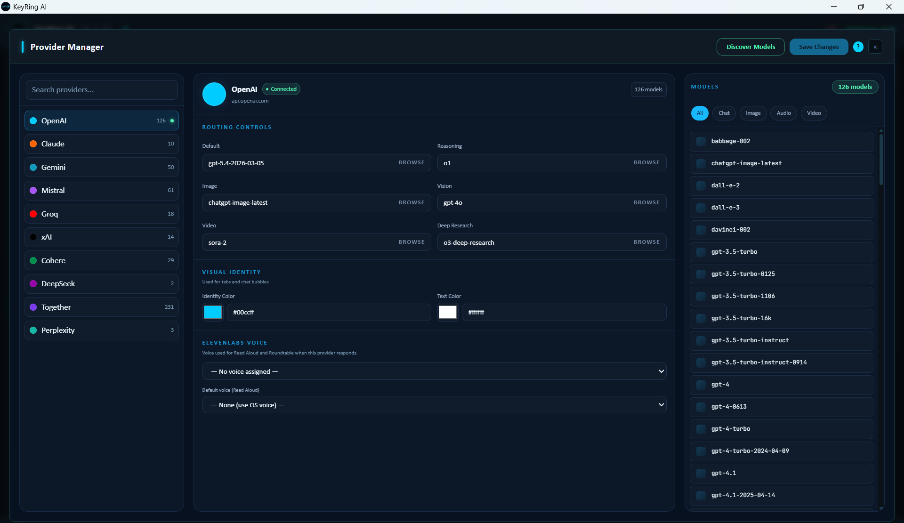

# Model Discovery

Model Discovery helps KeyRing AI keep up with providers that release, rename, preview, or retire models. Instead of requiring every public model name to be hard-coded in advance, the desktop app can ask a configured provider for its available model inventory and save that inventory into the local provider configuration.

_Public screenshot: Provider Manager is where discovered models are reviewed, mapped, and saved for use across the workspace._

The purpose is practical: when a provider releases a new model, the user should be able to discover it, save the provider configuration, and then select it in the relevant KeyRing AI workflows as long as the provider account can actually run it.

## What Discovery Does

Model Discovery contacts the selected provider's model-listing capability using the provider configuration and, where needed, a temporary discovery key. It builds an editable local model inventory for that provider. The user can review the results, filter them, collapse or expand sections, and save the provider configuration.

Once saved, discovered models become part of the local provider registry. They can appear in model pickers, routing mode mappings, provider tabs, Roundtable, Agent Builder, media workflows, or other surfaces depending on how the model is classified and which capabilities it exposes.

Discovery is a draft workflow until the user saves. This matters because provider model lists can be noisy. Some providers return internal, deprecated, inaccessible, or specialized model names. KeyRing AI gives the user a chance to review before replacing or expanding the saved model inventory.

## What Discovery Does Not Guarantee

Discovery does not guarantee that the provider account can run every discovered model. Providers may list models that require a different account tier, separate allow-listing, regional availability, beta enrollment, billing activation, or a provider-side entitlement.

Discovery also does not guarantee that every request setting is accepted by every model. A newly released model may reject parameters that older models accepted, or it may use provider defaults for settings such as temperature, top-p, tool choice, output format, or reasoning controls. KeyRing AI's model policy and request shaping layer exists so unsupported settings can be omitted instead of blindly sent to every model.

## Discovery And Mode Mapping

A model name alone is not enough. KeyRing AI needs to know what kind of workflow the model belongs to. A provider may expose chat models, reasoning models, image models, vision models, video models, audio-related models, or research-oriented models. Provider Manager lets those models be organized into mode mappings so they appear in the right workflows.

For example, a reasoning model should appear where reasoning workflows are available. An image model should appear in image workflows. A video model should appear where video generation or video job tracking makes sense. Keeping the mode mapping accurate prevents users from selecting a model in a workflow it cannot support.

## Newly Released Models

New model releases are exactly where Model Discovery is most valuable. The recommended path for a newly released model is to run discovery, save the provider configuration, confirm that the model appears in the expected picker, start with a conservative prompt and default settings, remove unsupported parameters if the provider rejects them, and verify account eligibility in the provider dashboard if access is denied.

This sequence separates KeyRing AI discovery from provider account access and model-specific parameter rules.

## Troubleshooting Discovery Results

If a discovered model appears but fails at runtime, check whether the provider account has access to that model. Then test a minimal prompt without tools, attachments, forced response formats, or advanced sampling parameters. If the minimal prompt works, reintroduce settings one at a time through Model Configuration.

If a model appears in the wrong workflow, review the provider's mode mappings in Provider Manager. If a model does not appear after discovery, confirm that the discovery result was saved and that filters are not hiding the model.

If discovery fails completely, verify the API key, provider base URL if applicable, provider service status, network access, and whether the provider supports the model-listing call used for discovery.

## Public Boundary

This document explains public Model Discovery behavior. It does not disclose proprietary provider policy code, internal adapters, source paths, private provider credentials, or implementation details that could weaken the product.
