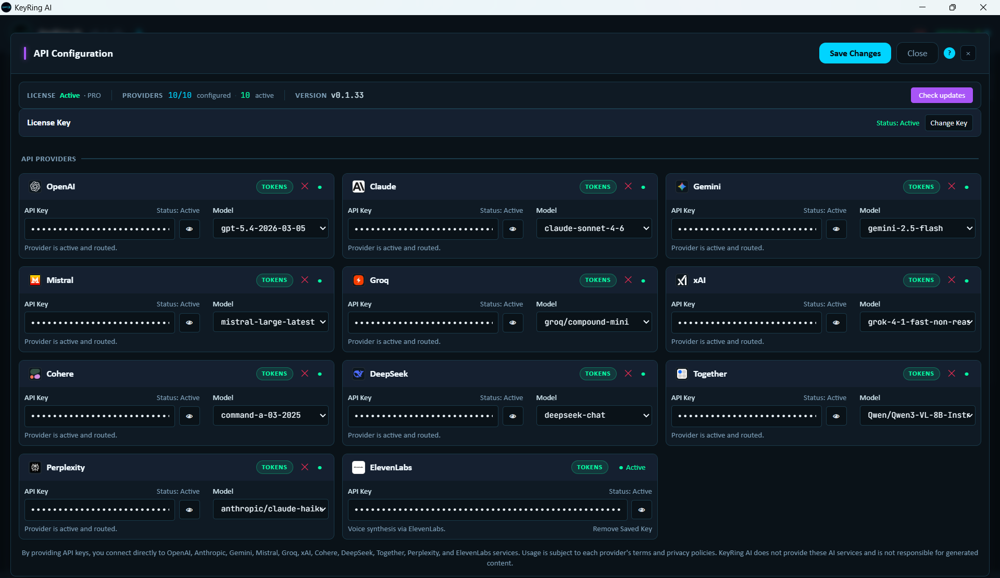

# Provider API Keys

KeyRing AI uses a bring-your-own-key provider model. You create and manage accounts with the AI providers you want to use, then save those provider API keys in the KeyRing AI desktop app.



_Public screenshot: provider API key configuration with credentials masked in the desktop app._

## Core Idea

KeyRing AI does not provide shared model access or a pooled provider account. For normal provider usage:

- You own the provider account.
- You own the provider billing relationship.
- You generate the provider API key.
- You decide which providers and models are active.
- Provider terms, limits, rate limits, and model availability apply.

## Before You Start

Prepare:

- A KeyRing AI install and active license
- An email address for each provider account you plan to create
- Provider dashboard access
- A billing method or credits where the provider requires paid API access
- Enough time to verify one provider before adding more

## One Provider Setup Flow

1. Open KeyRing AI.
2. Open API Settings.
3. Find the provider card you want to use.
4. Click the provider dashboard or token-management link.
5. Create or sign in to the provider account.
6. Complete billing or credit setup if required.
7. Generate a new API key in that provider dashboard.
8. Copy the key immediately. Many providers show the full key only once.
9. Paste the key into the matching provider field in KeyRing AI.
10. Save changes.
11. Select a working model.
12. Enable the provider and run a short test prompt.

## Good First Providers

OpenAI, Anthropic Claude, and Google Gemini are common first providers because their public dashboard flows are widely documented and map cleanly to typical KeyRing AI workflows.

Use official provider portals. Do not use third-party credential-sharing sites, leaked keys, shared organization keys, or keys copied from someone else's account.

## Provider Setup Matrix

| Provider-Side Item | Why It Matters |
| --- | --- |
| API key | Authenticates requests from your desktop app to the provider. |
| Billing or credits | Many providers reject API calls until billing is active. |
| Model access | Some models require plan access, allowlisting, region support, or a minimum account state. |
| Rate limits | Provider throttling can look like app failure if the account is over quota. |
| Terms and data policy | The selected provider receives prompts, attachments, and context you send to it. |

## What Happens After Save

After saving provider settings:

- The desktop app updates the selected provider configuration.
- The provider still needs to be active in the relevant workspace controls.
- The selected model must be available to your provider account.
- Provider-side billing, quota, and API status still matter.

A successful save does not guarantee future model access if the provider later blocks a model, changes your quota, disables billing, or returns an upstream API error.

## Provider Readiness Checklist

A provider is operational only when all of these are true:

```text
1) A valid provider API key is saved in API Settings
2) The provider is permitted by your current KeyRing AI license tier
3) A working model is selected for that provider
4) The provider is active in the desktop controls
5) The provider account itself has working API access and billing
```

## Key Hygiene

Treat provider API keys like passwords:

- Create separate keys for testing, daily work, and sensitive workflows where the provider supports it.
- Use provider dashboards to revoke keys you no longer need.
- Rotate a key immediately if it appears in a screenshot, GitHub commit, support log, chat transcript, or shared document.
- Do not paste provider keys into prompts.
- Do not include provider keys in public GitHub issues or public examples.
- Avoid using a personal key for team workflows unless that is intentional and approved.

## Common Issues

- **Invalid key:** generate a fresh key in the provider dashboard and save it again.
- **Billing or quota error:** add credits, enable billing, or resolve provider-side quota limits.
- **Model unavailable:** choose a model your provider account can access.
- **Provider inactive:** enable it in the relevant KeyRing workspace controls.
- **Wrong provider card:** make sure the key is saved on the matching provider.
- **New model discovered but failing:** confirm your provider account has access and remove unsupported advanced settings.

## Security Reminder

KeyRing AI's local-first design keeps normal provider requests on the desktop-to-provider path. It does not change the fact that the selected provider receives the content you send to it. Review provider terms before sending sensitive information.
