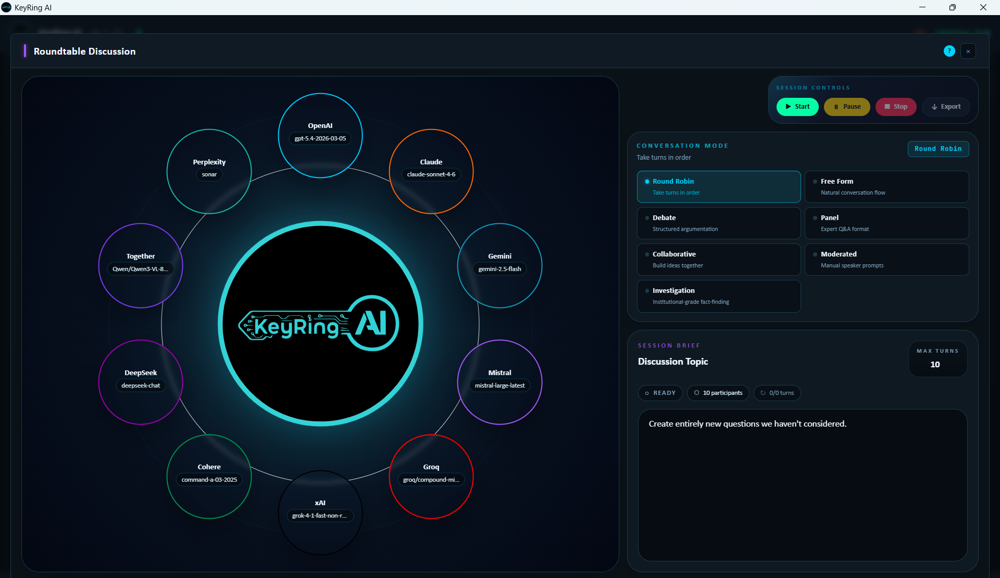

# Roundtable

Roundtable is KeyRing AI's structured multi-provider discussion workflow. It lets a user choose multiple providers and models, give them a shared topic or task, and run a controlled conversation where different models can compare, debate, investigate, collaborate, or build toward a final view.

_Public screenshot: Roundtable with provider participants, conversation modes, session controls, and session brief._

Roundtable is designed for evaluation and reasoning diversity. It is not a guarantee of correctness. Multiple models can reinforce the same mistake, and one dissenting answer can be more useful than a polished consensus. The value comes from making disagreement, assumptions, and reasoning patterns visible.

## When To Use Roundtable

Use Roundtable when a task benefits from more than one model perspective. Good use cases include vendor/model evaluation, strategy review, research planning, red-team style critique, creative ideation, policy analysis, documentation review, incident debriefs, and complex prompts where a single model answer may hide uncertainty.

Use a normal provider tab when the task is simple, latency-sensitive, or only needs one model. Roundtable adds power, but it also adds cost, token usage, and review complexity.

## Participants And Models

A Roundtable session requires multiple configured providers or models. The user chooses participants, model assignments, topic, turn limits, and workflow mode. Model access still depends on provider account permissions, quota, billing, and regional availability.

Before starting a serious session, run each participant with a short direct prompt. This catches missing keys, model access problems, unsupported settings, and provider outages before the conversation starts.

## Conversation Modes

Roundtable can support different discussion styles. Round-robin mode gives participants a predictable turn order. Free-form mode allows a more open exchange. Debate mode is useful when the user wants opposing positions surfaced. Panel mode is useful for expert-style responses. Collaborative mode is useful for building a shared answer. Moderated and investigation-style flows are useful when the user wants more structure around question asking, critique, and synthesis.

Choose the simplest mode that fits the task. A complex mode will not improve a poorly scoped prompt.

## Attachments In Roundtable

Attachments can be included in Roundtable workflows, but they should be scoped carefully. If every participant needs the same public source, attach it globally. If only one provider should see a file, scope it narrowly. Use metadata-only or first-lines modes when full content is unnecessary.

Because Roundtable can involve multiple providers, attachment discipline matters. Each selected provider may receive the prompt and context included for its role.

## Running A Session

Start with a clear topic and expected outcome. Select participants and models. Choose a mode and turn limit. Review active attachments and model settings. Start the session, watch participant status, and pause or stop if the conversation is drifting or producing avoidable cost.

After the session, review the transcript before accepting a conclusion. The transcript can be exported for internal review, but exports should be inspected for sensitive prompts, attachment references, customer data, or provider output that should not be shared.

## Public Boundary

This document describes public Roundtable behavior. It does not include proprietary orchestration logic, internal routing code, private prompts, or customer transcripts.
