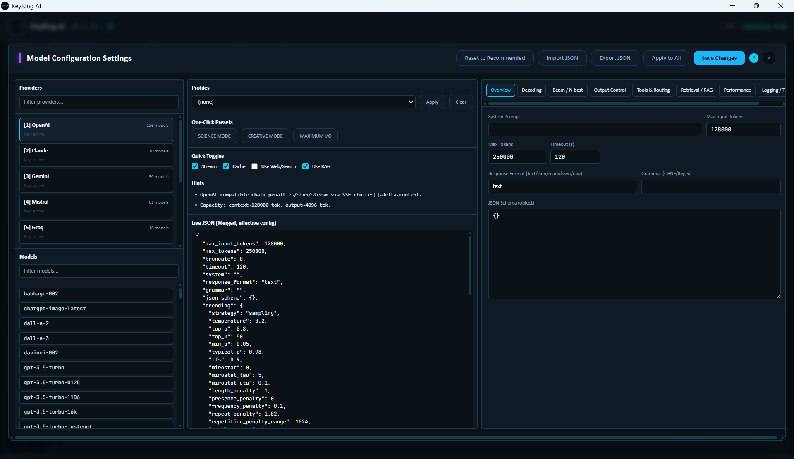
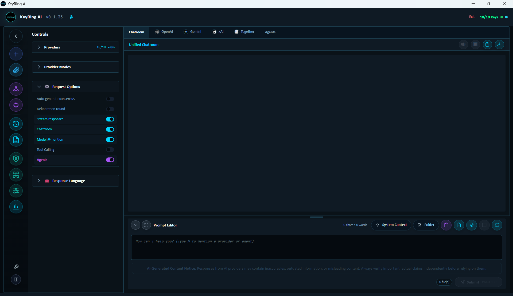
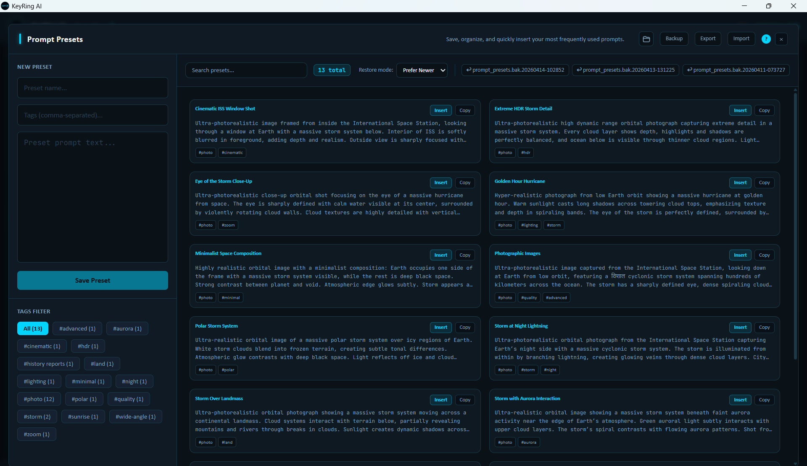
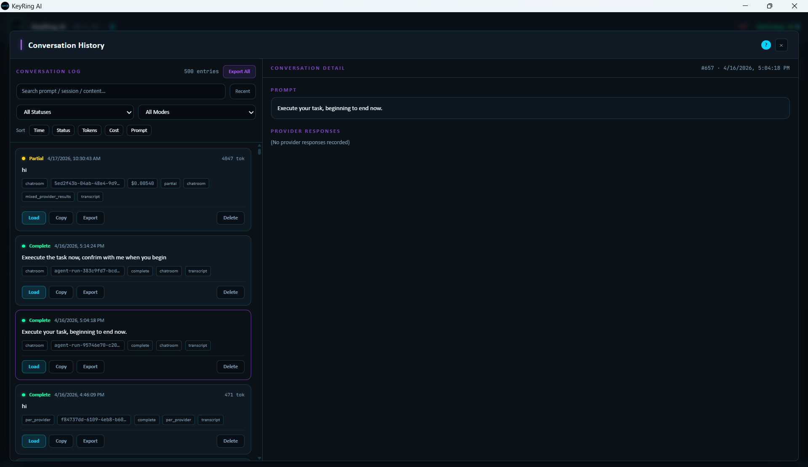
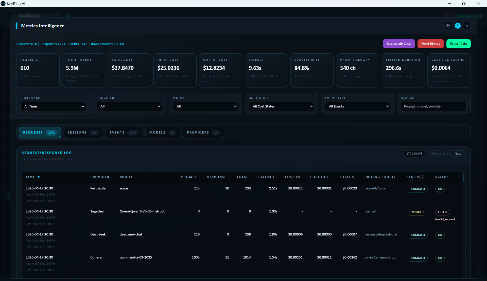
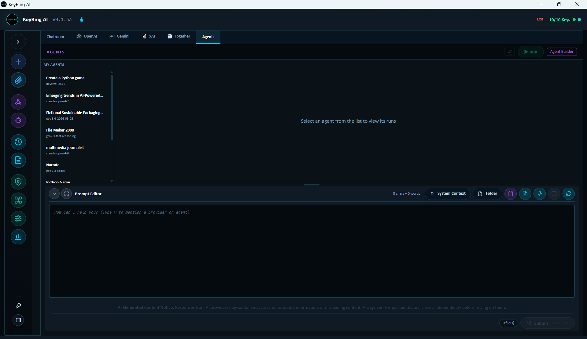
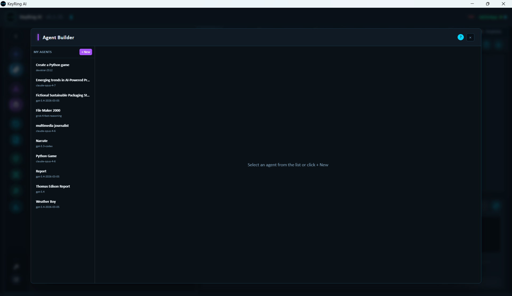

# Screenshot Gallery

This gallery collects public KeyRing AI product screenshots used throughout the documentation. The screenshots are intended to help customers, developers, and evaluators understand the product surface without exposing proprietary source code.

## Desktop Workspace

_Expanded desktop workspace with provider selection, modes, request options, Chatroom, and prompt editor._

_Collapsed workspace for a wider working canvas._

_Dock mode for a narrow always-available desktop workflow._

## Provider And Model Controls

_API Settings with provider cards, masked credentials, license state, models, and update controls._

_Provider Manager with provider inventory, routing controls, and discovered model list._

_Model Configuration with profiles, quick toggles, live JSON summary, and request controls._

_Request options for streaming, Chatroom routing, model mentions, tool calling, agents, and response language controls._

## Workspace Modules

_Chatroom collecting multiple provider responses into a unified transcript._

_Attachment Manager with scope, ingestion mode, token limits, and diagnostics._

_Prompt Presets with searchable saved prompts, tags, insert/copy actions, and backup/export/import controls._

_Conversation History with search, filters, load, copy, export, and delete actions._

_Metrics Intelligence with request, token, latency, cost, model, provider, event, recalculation, and export controls._

## Advanced Workflows

_Roundtable with provider participants, conversation modes, session controls, and session brief._

_Agents tab with saved agents, run controls, and Agent Builder entry point._

_Agent Builder listing saved agent configurations before editing or creating an agent._

## Preferences

_Settings with desktop notifications, app sizing, theme customization, and dangerous tool consent status._

## Public Boundary

Screenshots in this repository must remain public-safe. Do not add screenshots that expose provider API keys, license keys, secrets, customer data, private prompts, private source code, local source paths, internal infrastructure, or security-sensitive implementation details.
