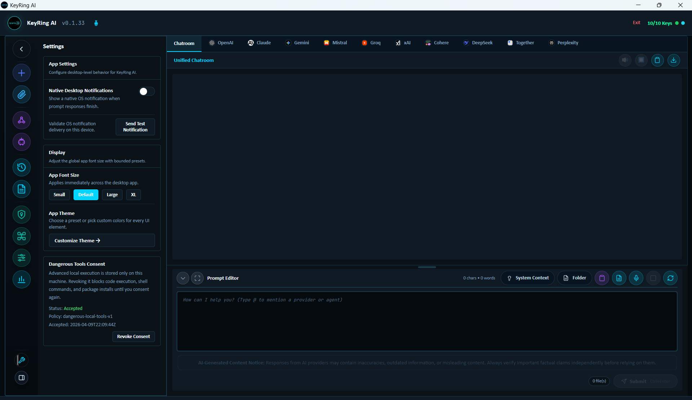

# Settings

Settings is where users adjust desktop-level behavior for KeyRing AI. It covers app preferences that affect the local workspace rather than provider account setup.

_Public screenshot: Settings with desktop notifications, app sizing, theme customization, and dangerous tool consent status._

## Desktop Notifications

Native desktop notifications help users see when a prompt response finishes or when the app needs attention. A test notification control lets the user confirm that operating-system notification delivery is working.

## Display Preferences

Users can adjust app sizing through bounded presets. This is useful when moving between laptop, docked monitor, and narrow dock-mode workflows.

## Theme Controls

The settings surface can expose theme customization for users who want the workspace to match their visual preference or review environment.

## Dangerous Tool Consent

Settings also gives users visibility into dangerous tool consent. If advanced local execution or tool-capable workflows are enabled, users should understand the consent state and revoke access when they no longer need that capability.

## Public Boundary

This document describes public settings behavior. It does not include private implementation details, local storage paths, internal policy enforcement, source code, or security bypass information.
